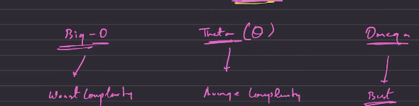

My DSA Journey.

Patterns: 

4 main rules for the pattern are 

        1) Figure out the no of lines to print, **Write the outer loop based on that.**
        2) Figure out what is happening at each line and connect with the outerloop, **Write the inner loop based on that**.
        3) Execute the print statements.
        4) Observe the symmetry.

what is time complexity?

    How many times does your code runs basic operation as n (Input) grows?
    we usually count the {Comparisions, loops, prints, assignments} but we only care about the growth not the individual numbers.
    Thats the reason we onlyuse the Big O notation.

Golden rules to remember?

    1) Ignore Constants ==> O(2n) ---> O(n)
                            O(5)  ---> O(1)

    2) Sequential code ==> Loop 1 -> O(n)
           (ADD)           Loop 2 -> O(n)
                        ____________________
                    Add/Total => O(n+n) = O(n)

    3) Nested Loop  ===> for i=1 to n
         (Multiply)          for j=1 to n
                        -------------------
                Total => O(n*n) = O(n2)   "n2 is means n square"

    4)Dependent Loops
        If a inner loop runs based on the outer loop variable the total work usually becomes O(n2)
            Why => O(n2) -> inner loop grows linearly
                            outer loop grows linearly
                            --------------------------
                            Combined grows quadratically
    5) Shrinking input
        If your input is divided or reduced each step the time complexity is O(log n)

            while(n>2){
                n=n/2;}  //Reason is we dont loop n times, reduce the problem size each time.

    6) Mixed Loops (Multiply)
        for(i =0 -> n){   ---> outer loop = O(n)
            while(n>1){   ---> Inner Loop = O(logn)
                n=n/2;
            }
        }
        Combined === O(nlog n)

All Common Time Complexities:

    O(1) ---> Constant Time
              Does not depend on the input
              Faster

    O(log n) ---> Logarithmic
                  Input shrinks every step (n=n/2)
                  Ex: Binary search, Divide & Conquer, Tree height

    O(n) ----> Linear
               Grows Directly with input
               print array, count elements,Find min/max

    O(n log n) --> Logarithmic 
                   Common in efficient sorting
                   Merge sort,Quick sort, heap sort

    O(n 2) ----> Quadratic 
                 Patterns
                 Bubble Sort
                 Selection Sort

Two Main Rules here are: 1) Consider the worst case scenario, 2) Avoid Constants.
    

Space Complexity:
            How much extra memory your program uses as input grows. 
Rules:

    constant variables : ---> O(1)
        Ex: int a=10;
            int b=20;
            int sum = a+b;
    
    Arrays/Stings Depending on N ---> O(n)
        Memory grows with n 
            int [] arr = new int[n];

    2d arrays -->O(n2)

    Recursion -> Stack space O(n)

    """ loops dont increase space -only data structures and recurssion do """
